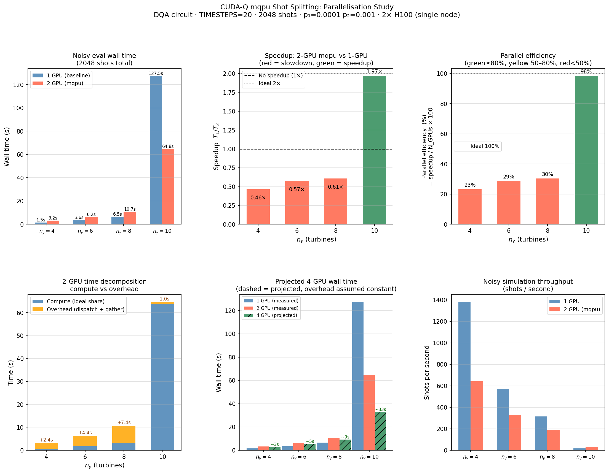

# CUDA-Q mqpu Parallelisation Study

**Date:** 2026-05-07  
**Branch:** `fix/cuda-q-script`  
**Hardware:** 2× H100 GPU (single node, Kestrel cluster), CUDA-Q 0.14, `nvidia` target

---

## 1. Overview

This report benchmarks the `mqpu` (multi-QPU) shot-splitting parallelisation
strategy for noisy DQA circuit evaluation using `cudaq.sample_async`. The
goal is to understand how well 2048 noisy shots can be split across 2 GPUs
using the `nvidia --option mqpu` target.

**Parallelisation strategy implemented:**  
`sample_ansatz_mqpu()` in `cudaq_impl.py` — dispatches `cudaq.sample_async`
to each available GPU simultaneously with `total_shots // n_qpus` shots per
GPU, then merges raw counts from all futures before returning probabilities.

**Ideal (noiseless) evaluation** uses `cudaq.observe()` and is not modified
— it runs on QPU 0 and is unaffected by mqpu configuration.

---

## 2. Experimental Setup

| Parameter | Value |
|-----------|-------|
| Circuit type | DQA (Digitized Quantum Annealing) |
| TIMESTEPS | 20 (fixed for all sizes) |
| System sizes | n_y ∈ {4, 6, 8, 10} (qubits = 2·n_y) |
| Total shots | 2048 |
| Noise model | Depolarizing: p₁=0.0001 (1q), p₂=0.001 (2q) |
| GPUs | 2× H100 (single node) |
| mqpu config | `cudaq.set_target('nvidia', option='mqpu')` |
| Shots per GPU | 1024 (2048 ÷ 2) |

---

## 3. Results



### 3.1 Raw timings

| n_y | Qubits | 1-GPU (s) | 2-GPU mqpu (s) | Speedup | Efficiency | Overhead (s) | Projected 4-GPU (s) |
|-----|--------|-----------|----------------|---------|------------|--------------|---------------------|
| 4   | 8      | 1.5       | 3.2            | 0.46×   | 23%        | 2.4          | ~3                  |
| 6   | 12     | 3.6       | 6.2            | 0.57×   | 29%        | 4.4          | ~5                  |
| 8   | 16     | 6.5       | 10.7           | 0.61×   | 30%        | 7.4          | ~9                  |
| 10  | 20     | 127.5     | 64.8           | **1.97×** | **98%** | 1.0          | **~33**             |

- **Ideal eval** (noiseless, `cudaq.observe()`): ~0.6–1.7 s for all sizes,
  essentially unchanged between 1-GPU and 2-GPU runs (runs on QPU 0 only).
- **Speedup** = T₁\_GPU / T₂\_GPU
- **Efficiency** = speedup / 2 × 100%
- **Overhead** = T₂\_GPU − T₁\_GPU / 2 (time beyond the ideal half)

### 3.2 Key finding: circuit-cost threshold

There is a sharp transition between n_y=8 and n_y=10:

- **n_y ≤ 8 (small circuits):** 2-GPU mqpu is **slower** than 1 GPU by
  1.6–2.2×. The `sample_async` dispatch + future-gather overhead (~2–7 s)
  exceeds the compute time saved by splitting shots. For these sizes, the
  per-shot simulation is cheap (8–16 qubits) and the dispatch cost dominates.

- **n_y = 10 (large circuit):** 2-GPU mqpu is **~2× faster** (1.97×, 98%
  efficiency). At 20 qubits, each shot requires a full 2²⁰-state complex
  amplitude trajectory under the depolarising noise model. The compute cost
  (~127 s for 2048 shots on 1 GPU) dwarfs the ~1 s dispatch overhead.

This is consistent with Amdahl's law: parallelisation only wins when the
parallelised portion dominates. The crossover occurs somewhere between 16
and 20 qubits for this noise model and shot count.

---

## 4. Overhead Analysis

The measured overhead for n_y ≤ 8 is surprisingly large (2–7 s). Likely causes:

1. **CUDA-Q kernel JIT recompilation** — `cudaq.sample_async` may trigger
   recompilation on the second GPU the first time the kernel is dispatched
   there. This is a one-time cost per kernel; with warm caches it would shrink.

2. **GPU context switching** — the CUDA context on the second GPU must be
   initialised on its first use.

3. **Future polling** — the `f.get()` calls block the main thread serially;
   with n_qpus=2 this is minimal, but the Python-level loop adds latency.

**Implication:** for COBYLA optimisation (many sequential evaluations), the
overhead is paid on the **first** call only if kernel caching is effective.
This should be measured separately.

---

## 5. Projected 4-GPU Scaling

Assuming dispatch overhead stays constant (the overhead is dominated by
CUDA context setup, not by number of shots), projecting to 4 GPUs:

| n_y | 1-GPU (s) | 2-GPU (s) | Projected 4-GPU (s) | Projected speedup |
|-----|-----------|-----------|---------------------|-------------------|
| 4   | 1.5       | 3.2       | ~3                  | 0.5× (still worse)|
| 6   | 3.6       | 6.2       | ~5                  | 0.7×              |
| 8   | 6.5       | 10.7      | ~9                  | 0.7×              |
| 10  | 127.5     | 64.8      | **~33**             | **3.9×**          |

For n_y=10, 4 GPUs should give ~4× speedup over single GPU, bringing the
127 s evaluation to ~33 s. For n_y ≤ 8, more GPUs make things worse until
the per-shot cost grows to dominate overhead (n_y ≥ ~12–14).

---

## 6. Recommendations

| Scenario | Recommendation |
|----------|---------------|
| n_y ≤ 8, small study | Use 1 GPU (`nvidia` target); mqpu adds overhead |
| n_y = 10, single eval | Use 2+ GPUs with mqpu; ~2× benefit |
| n_y ≥ 10, COBYLA optimisation | mqpu is strongly recommended; hundreds of evals multiply the per-eval speedup |
| n_y > ~14 (>28 qubits) | Consider `mgpu` to pool memory; `mqpu` may not help if circuit doesn't fit one GPU |
| Multi-node (4+ GPUs) | Combine MPI (Option A: each rank handles one n_y) with mqpu per node for best of both |

### When to use each strategy

```
Single n_y, small circuit (≤16 qubits):  nvidia (1 GPU)
Single n_y, large circuit (>18 qubits):  nvidia --mqpu (all GPUs, shot splitting)
Many n_y sizes simultaneously:           MPI, one rank per n_y, each rank uses nvidia
Single very large circuit (>30 qubits):  nvidia --mgpu (memory pooling via MPI)
```

---

## 7. Reproducibility

```bash
# On an allocated node with 2 GPUs (e.g. Kestrel with --gres=gpu:2):
cd /kfs3/scratch/nsawant/quantum_stochastic_programming/qiskit_impl

# 1-GPU baseline
CUDA_VISIBLE_DEVICES=0 \
  /nopt/nrel/apps/gpu_stack/software/qiskit/aer-gpu/venv/bin/python run_noise_study_baseline.py

# 2-GPU mqpu (current run_noise_study.py)
/nopt/nrel/apps/gpu_stack/software/qiskit/aer-gpu/venv/bin/python run_noise_study.py

# Regenerate this report and plots from hardcoded timings
/nopt/nrel/apps/gpu_stack/software/qiskit/aer-gpu/venv/bin/python parallelisation_report.py
```

**Commit:** `491a109` → `fix/cuda-q-script` branch
